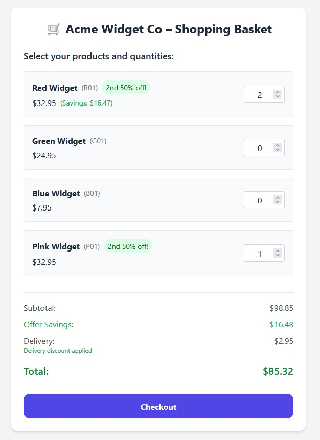

# Acme Widget Co - Shopping Basket

A Laravel-based shopping basket application that implements various business rules for product pricing, delivery costs, and special offers. The system is designed to be highly extensible, allowing for easy addition of new products and promotional offers.

## Features

### Core Functionality
- Product management with basic properties (code, name, price)
- Shopping basket with quantity selection
- Real-time price calculations
- Special offers implementation
- Delivery cost rules based on order value
- Extensible architecture for easy addition of new features

### Special Offers
- Buy One Get One Half Price offer for Red Widgets
- Dynamic offer display on product cards
- Real-time discount calculations
- Visual indication of savings
- Offer system that allows:
  - Adding new types of offers
  - Applying offers to specific products
  - Configuring offer parameters

### Product Management
- Basic product configuration (code, name, price)
- Easy addition of new products
- Support for product-specific offers

### Delivery Rules
- Standard delivery: $4.95 (orders under $50)
- Premium delivery: $2.95 (orders between $50 and $90)
- Free delivery: $0.00 (orders over $90)
- Configurable delivery thresholds and costs

### User Interface
- Modern, responsive design using Tailwind CSS
- Real-time updates without page refresh
- Clear display of:
  - Product prices
  - Applied discounts
  - Delivery costs
  - Total amount
- Disabled checkout button when basket is empty
- Success messages after checkout

### Checkout Process
- Automatic receipt generation and download in text format
- Receipt file includes:
  - Purchase date and time
  - Itemized product list with:
    - Product codes
    - Quantities
    - Individual prices
    - Applied discounts per item
  - Order summary with:
    - Subtotal
    - Total discounts
    - Delivery costs
    - Final total
- Receipt is automatically downloaded as `receipt_YYYY-MM-DD.txt`
- Basket reset after successful checkout

### Testing
- Test suite covering:
  - Basket calculations
  - Special offers
  - Delivery rules
  - Controller functionality
  - Basic error handling

## Installation

1. Clone the repository
2. Install dependencies:
   ```bash
   composer install
   ```
3. Configure your environment:
   ```bash
   cp .env.example .env
   php artisan key:generate
   ```
4. Start the development server:
   ```bash
   php artisan serve
   ```

## Configuration

### Products
Configure products in `config/products.php`:
```php
return [
    [
        'code' => 'R01',
        'name' => 'Red Widget',
        'price' => 32.95
    ],
    // Add more products...
];
```

### Offers
Configure offers in `config/offers.php`:
```php
return [
    'buy_one_get_half_price' => [
        'class' => BuyOneGetOneHalfPrice::class,
        'products' => ['R01'],
        'display_text' => '2nd 50% off!',
    ],
    // Add more offers...
];
```

### Delivery Rules
Configure delivery rules in `config/delivery.php`:
```php
return [
    'rules' => [
        ['limit' => 50.0, 'cost' => 4.95],
        ['limit' => 90.0, 'cost' => 2.95],
        ['limit' => PHP_FLOAT_MAX,  'cost' => 0.0],
    ],
];
```

## Extending the System

### Adding New Products
1. Add the product configuration in `config/products.php`
2. The system will automatically:
   - Display the new product in the interface
   - Include it in price calculations
   - Make it available for offers

### Adding New Offers
1. Create a new offer class implementing the `OfferInterface`
2. Add the offer configuration in `config/offers.php`
3. The system will automatically:
   - Apply the offer to specified products
   - Display offer information in the interface
   - Calculate discounts in real-time

### Modifying Delivery Rules
1. Update the rules in `config/delivery.php`
2. The system will automatically:
   - Apply new delivery costs
   - Update delivery messages
   - Recalculate totals

## Running Tests

Run the test suite:
```bash
php artisan test
```

## Contributing

1. Fork the repository
2. Create your feature branch
3. Commit your changes
4. Push to the branch
5. Create a new Pull Request

## License

This project is licensed under the MIT License.

## Screenshot

